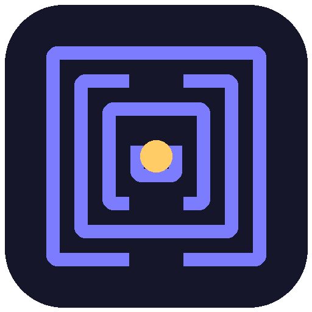

<p align="center"></p>

<h1 align="center">Daedalus</h1>

<p align="center"><strong>The self-evolving, local-first coding assistant — powered by the Hermes Deep Mind engine.</strong></p>

<p align="center">
  <a href="https://pypi.org/project/daedalus-ai/"></a>
  <a href="https://marketplace.visualstudio.com/items?itemName=kinglabs.daedalus-vscode"></a>
  
  
</p>

---

Daedalus is a coding agent that runs on **your own machine and your own models** (Ollama local, or any of 24 providers). One engine, three surfaces — a rich **terminal**, a **web IDE**, and a **VS Code extension** — and a cognitive stack no other assistant ships: persistent memory, a failure "immune system", sleep-time compute, judge-verified goals, causal blast-radius prediction, MoE routing, and learned confidence calibration.

It doesn't just chat. It scaffolds runnable full-stack/mobile apps, verifies them, and prepares the deploy.

```bash
pip install daedalus-ai
daedalus            # rich terminal UI
daedalus web        # web IDE in your browser
daedalus app        # native desktop window
```

---

## Why it's different

| | Daedalus | Typical assistant |
|---|---|---|
| **Runs on** | your local models (Ollama) + 24 providers | 1–3 cloud APIs |
| **Memory** | persistent across sessions; rebuilds context from checkpoints | forgets each session |
| **Learns while idle** | subconscious dreams/distills into memory & skills | only thinks when prompted |
| **Stops when done** | independent judge must confirm the goal | claims done optimistically |
| **Before an edit** | predicts blast radius from git co-change history | edits blind |
| **Routing** | validated-live MoE across providers, learned calibration | fixed model |
| **Ships** | scaffolds → verifies (eval gate) → deploys | code only |

---

## Install

```bash
pip install daedalus-ai                      # from PyPI
# optional extras:
pip install "daedalus-ai[app]"               # native desktop window (pywebview)
pip install "daedalus-ai[browser,desktop]"   # Playwright browser + PyAutoGUI desktop control
```

From source:

```bash
git clone https://github.com/KingLabsA/daedalus.git && cd daedalus
./install.sh
```

---

## The three surfaces

### 1. Terminal — `daedalus`
A rich TUI: streamed tokens, markdown + syntax highlighting, inline **diff-approve** before writes, `@file` mentions, input history, `Ctrl-C` to cancel mid-run. Shows which provider each answer routed to.

**Headless one-shot** for CI / scripts / git hooks:
```bash
daedalus run "fix the failing test" --yes --json
# {"ok": true, "result": "...", "routed_to": "freellmapi", "files_changed": ["test_x.py"]}
```

### 2. Web IDE — `daedalus web`
One process serves the built UI + agent over a token-protected WebSocket. The **Cockpit** puts everything on one page:
- **Chat** with inline changeset review (accept/reject per file *or* per hunk)
- **Monaco editor** with live file tree
- **Terminal** (sandboxed command stream) + **Preview** (live app canvas)
- **ShipBar** — one-click Scaffold / Verify / Deploy

Plus a **Mind** dashboard: memory, subconscious activity, calibration curve, expert routing, blast-radius predictor, device doctor, model advisor.

### 3. Desktop — `daedalus app`
A **real native window** (pywebview → WebKit/WebView2/GTK), not a browser tab and not Tauri. `./build_app.sh` produces a self-contained double-clickable **`Daedalus.app`** via PyInstaller (bundles Python + agent + UI).

### 4. VS Code — [`kinglabs.daedalus-vscode`](https://marketplace.visualstudio.com/items?itemName=kinglabs.daedalus-vscode)
Chat sidebar + native inline diffs driven by the changeset protocol.

---

## Models — local-first, free-first

Daedalus **auto-routes** every request (easy → free local model, hard → strongest live provider) and only uses providers that **actually answer** — keys are validated with a live probe, not just checked for presence.

- **Ollama** (recommended): `brew install ollama && ollama serve`, then `ollama pull qwen2.5-coder:7b`. Local models are context-capped (`HERMES_LOCAL_NUM_CTX`, default 8192) and routed through Ollama's native API so `num_ctx` is honored (avoids an 8B model ballooning to 23 GB).
- **FreeLLMAPI** gateway: launch it, set `FREELLMAPI_API_KEY`.
- **OpenCode Zen**: `OPENCODE_API_KEY` (frontier models via one key).
- **Free cloud tiers**: Groq, Google AI Studio, Mistral, Cerebras, DeepSeek — put keys in `.env`.

`daedalus doctor` shows exactly which providers are live right now and what's missing. `daedalus models` shows which models your hardware can run.

Useful env: `HERMES_AUTO_ROUTE=off`, `HERMES_LLM_TIMEOUT=120`, `OLLAMA_MODEL=<name>`, `HERMES_SUBCONSCIOUS=off`.

---

## The Deep Mind engine (Hermes)

- **Context Engine** — persistent memory (SQLite FTS), budgeted injection, checkpoint-based context reconstruction instead of truncation.
- **Failure Immune System** — every tool failure becomes a searchable "antibody"; before acting it checks whether it got burned this way before, in *this* repo.
- **Subconscious** — sleep-time compute: consolidates session experience into memory and distills repeated workflows into skills while idle.
- **GoalJudge** — an independent model verifies a `/goal` is truly complete before stopping (fail-open).
- **Causal World Model** — mines git co-change history + import graph to predict an edit's blast radius, and warns before high-risk writes.
- **Model Orchestra (MoE)** — classifies each task and routes to the best expert; committees + judged Max Mode best-of-N.
- **Epistemic Engine** — records predicted confidence vs actual outcomes; cost-aware routing driven by *learned* calibration.
- **Senses** — image analysis, video understanding (ffmpeg frame sampling), voice in/out.
- **Native MCP client** — connect any Model Context Protocol server via `.hermes/mcp.json`.
- **Profile builder** — first-launch interview pre-builds persona skill packs (developer, PM, doctor, engineer, …).

Self-* loop: self-learning (record → skill), self-verification (pytest gate), self-correction (errors feed back), self-implementation (writes & registers its own tools).

---

## Text-to-app → verify → deploy

```bash
daedalus run "build a tailwind todo app called Tasks" --yes
```

**Scaffold** (17 kinds, runnable — not stubs): `web` · `tailwind`/`shadcn` · `supabase` · `next`/`t3` · `astro` · `svelte` · `api` (FastAPI) · `saas`/`fullstack` · `cli` · `mobile`/`ios`/`android` (Expo) · `mcp` (a self-extending MCP tool server). Uses the canonical `create-*` generator when installed, else a built-in skeleton.

**Verify** (eval gate) — build must pass / code must compile / tests must be green / MCP must handshake. A broken app is **blocked** from deploying.

**Deploy** — detects the project, writes the provider config (`vercel.json` / `netlify.toml` / `fly.toml` / `eas.json`), and hands you the exact commands. Targets: Vercel, Netlify, Fly.io, Expo EAS. (It prepares everything; the authenticated `login` step is yours.)

---

## Commands (CLI & web)

`/goal` · `/multitask` · `/kanban` · `/memory` · `/remember` · `/dream` · `/distill` · `/subconscious` · `/blast <file>` · `/experts` · `/max` · `/route` · `/calibration` · `/see ` · `/say` · `/listen` · `/doctor` · `/models` · `/profile` · `/mcp` · `/ship <kind> <name>` · `/deploy <target>` · `/checkpoint` · `/safety` · `/provider` · `/reset` — full list via `/help`.

---

## Architecture

```
agent_ultimate.py        Think→Act→Observe loop, tool registry, safety
core/
  providers.py           24 providers, MoE-tier router, validated liveness, cost
  server.py              WebSocket protocol (chat, files, changesets, ship/deploy)
  context/               memory, immune system, checkpointer, budgeter
  cognition/             dream, distill, judge, subconscious
  intel/                 code intel, LSP client, embeddings, causal world model
  senses/                MoE orchestra, vision, voice
  epistemic/             calibration, cost router, Max Mode
  platform/              MCP client, doctor, profiler, model advisor
  changeset.py           per-file & per-hunk edit review
  scaffold.py            text-to-app (17 kinds)
  deploy.py / evalgate.py   deploy planning + pre-ship verification
desktop/                 React web UI (Cockpit, Mind, editor)
vscode-extension/        VS Code client
bench/swebench_runner.py SWE-bench harness
```

Standalone `core/*` packages import nothing from the monolith; the monolith re-exports for back-compat. 291 offline tests, CI on macOS + Linux × Python 3.11–3.13, ruff-clean.

---

## Development

```bash
pip install -e ".[dev]"
python -m pytest tests/ -q          # offline suite (291)
python -m ruff check .              # lint gate
cd desktop && npm install && npm run build   # web UI
```

Contributions welcome — see [CONTRIBUTING.md](CONTRIBUTING.md). Security policy in [SECURITY.md](SECURITY.md).

---

## Status & honest notes

- **Positioning:** single-user, local-first by design (not multi-tenant/SaaS).
- **Desktop:** the pywebview `daedalus app` is the recommended standalone; the legacy Tauri path is parked on an upstream macOS bug.
- **Benchmarks:** a SWE-bench harness ships in `bench/`, but no score is published yet — run it locally with a strong provider before quoting one.

## License

MIT © KingLabs. Product: **Daedalus**. Engine: **Hermes**.
